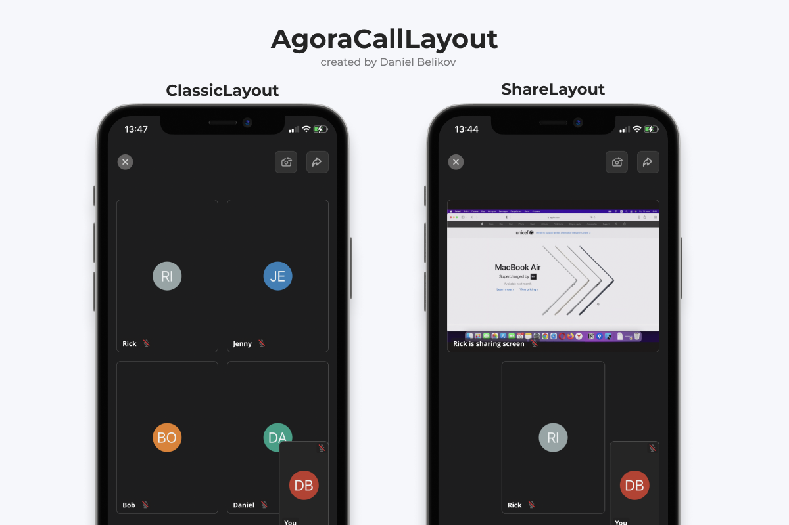

# AgoraCallLayout

A handy library for building a grid for video calls through the Agora SDK. This will help you correctly display a grid of call participants based on a UICollectionView.



## Installation

### Swift Package Manager

AgoraCallLayout is available through [Swift Package Manager](https://swift.org/package-manager/). To install
it, in Xcode 13.0 or later select `File` > `Swift Packages` > `Add Package Dependency...` and add AgoraCallLayout repository URL:
```
https://github.com/daniilbelikov/AgoraCallLayout.git
```

## How it works?

1. Create an instance of the AgoraCallLayout class.

``` swift
let agoraLayout = AgoraCallLayout()
```

2. Initialize your UICollectionView with the following options:

``` swift
yourCollectionView.autoresizingMask = [.flexibleWidth, .flexibleHeight]
yourCollectionView.collectionViewLayout = UICollectionViewFlowLayout()
```

3. Add the following methods to UICollectionViewDelegateFlowLayout:

``` swift
extension MyViewController: UICollectionViewDelegateFlowLayout {
    
    func collectionView(_ collectionView: UICollectionView,
                        layout collectionViewLayout: UICollectionViewLayout,
                        sizeForItemAt indexPath: IndexPath) -> CGSize {
        
        // isSharing: the state when someone is sharing the screen
        // usersCount: the number of participants in the call
        
        return agoraLayout.generateLayout(isSharing: false,
                                          collectionView: collectionView,
                                          indexPath: indexPath,
                                          usersCount: 4)
    }
    
    func collectionView(_ collectionView: UICollectionView,
                        layout collectionViewLayout: UICollectionViewLayout,
                        insetForSectionAt section: Int) -> UIEdgeInsets {
        
        return agoraLayout.insetForSectionAt
    }
    
    func collectionView(_ collectionView: UICollectionView,
                        layout collectionViewLayout: UICollectionViewLayout,
                        minimumLineSpacingForSectionAt section: Int) -> CGFloat {
        
        return agoraLayout.minimumLineSpacing
    }
    
}
```
